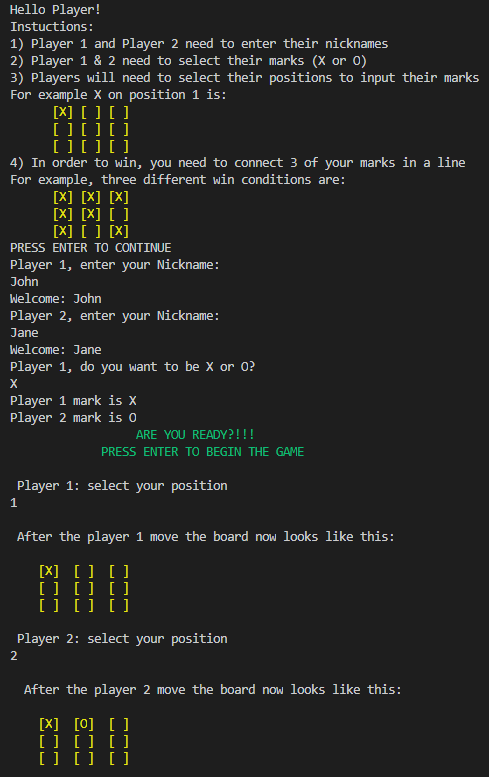
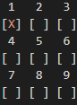
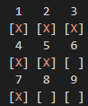

## RUBY Tic Tac Toe

Implementation of Tic-Tac-Toe classic game



## Built With

- Ruby

### Prerequisites

* On Windows:
Have Ruby installed
* Mac & Linux:
Latest version of Ruby installed

## Getting Started

- Run this command in your OS terminal: `git clone https://github.com/ccobasi/Tic_Tac_Toe.git` to get a copy of the project.

### Setup

* Clone the repository
- Go to the "Code" section of this repository and press the green button that says "Code". Copy the URL or the SSH key.
- Go to the terminal and enter:
```
git clone URL/SSH key
```
- If you don't have git you can download this project and unzip it.

### Usage

* On Windows:
- Start a new Terminal 
- Go to the directory where you cloned the game
- Type:
```
 cd bin
```
and press ENTER

- Type:
```
 ruby main.rb 
```
and press ENTER


* Mac & Linux:
- Start a new Terminal 
- Go to the directory where you cloned the game
- Type: 
```
cd bin
```
and press ENTER

- Type:
```
 $ ruby main.rb
```
and press ENTER

## Instructions:

- Setup:
1) Player 1 and Player 2 need to enter their nicknames
2) Player 1 needs to select his mark (X or O), Player 2 gets the leftover mark

Gameplay:
1) Press enter to begin the game!
2) Players will need to select their positions (1 to 9) to input their marks one turn after the other

For example X on position 1 is: 


      
3) Players need to input their positions on empty spaces or the game will display an invalid input error and make you select again  
4) In order to win, you need to connect 3 of your marks in a row, column or diagonal

For example, three different win conditions are (1,2,3 / 1,4,7 / 3,5,7):



5) The game asks you if you want to play again input YES/NO, if you dont want to play again, the game will end

## Authors

👤 **Andres Leon**

- GitHub: [@notrexxx](https://github.com/notrexxx)
- Twitter: [@emigdioleon1](https://twitter.com/emigdioleon1)
- LinkedIn: [Emigdio Leon](https://linkedin.com/emigdio-leon-689109195)

👤 **Chukwuma Obasi**
- GitHub: [@ccobasi](https://github.com/ccobasi)
- Twitter: [@obasichux](https://twitter.com/obasichux)
- LinkedIn: [Chukwuma Obasi](https://www.linkedin.com/in/chukwuma-obasi-532b84188)

## Show your support

Give a ⭐️ if you like this project!

## Contributing

Contributions, issues, and feature requests are welcome!

Feel free to check the [issues page](https://github.com/ccobasi/Tic_Tac_Toe/issues).

## Acknowledgments

- Stand Up Team

## 📝 License

This project is [MIT](./LICENSE) licensed.
